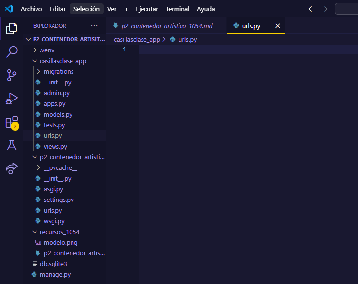
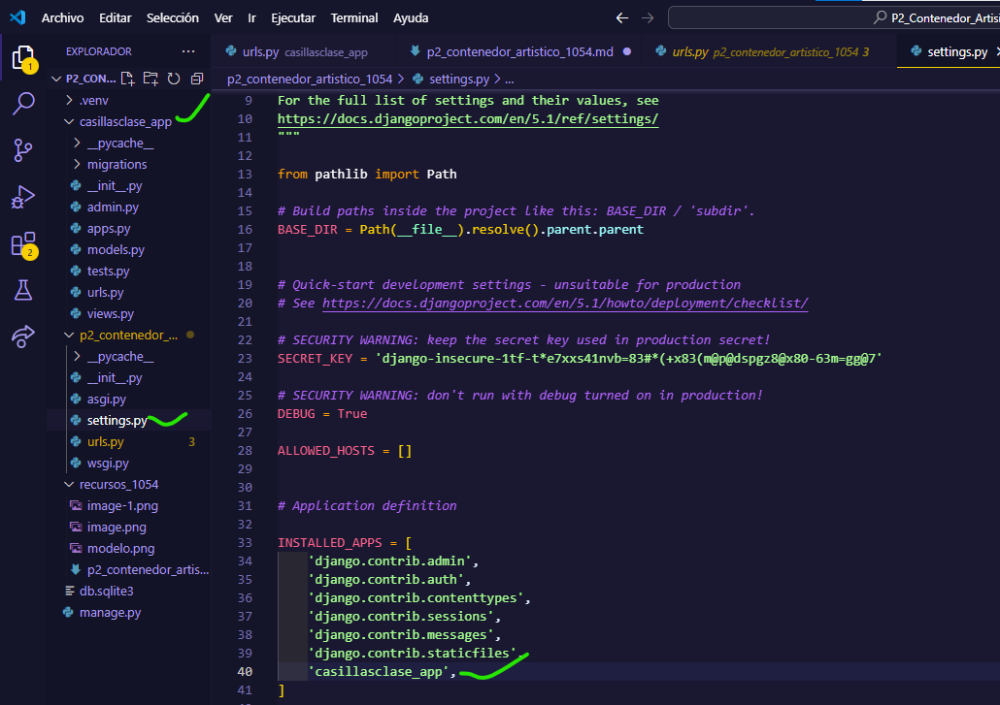
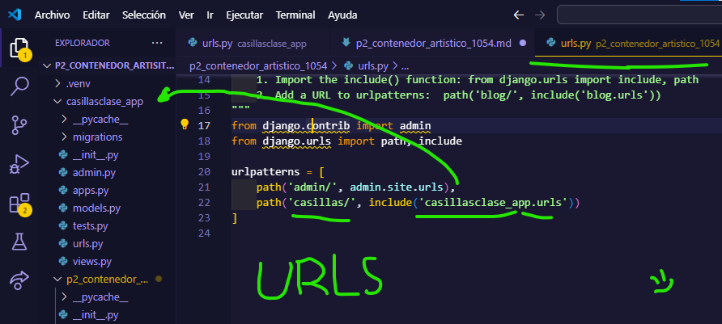
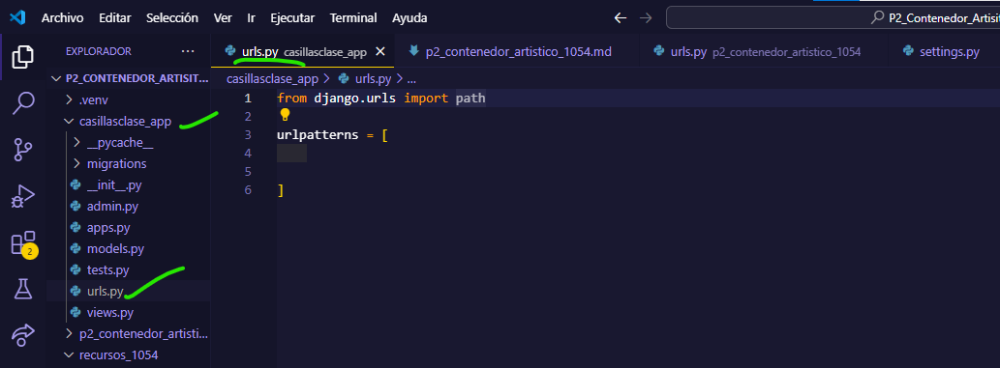
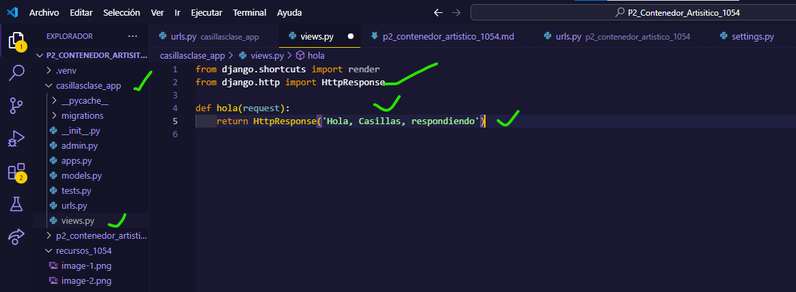
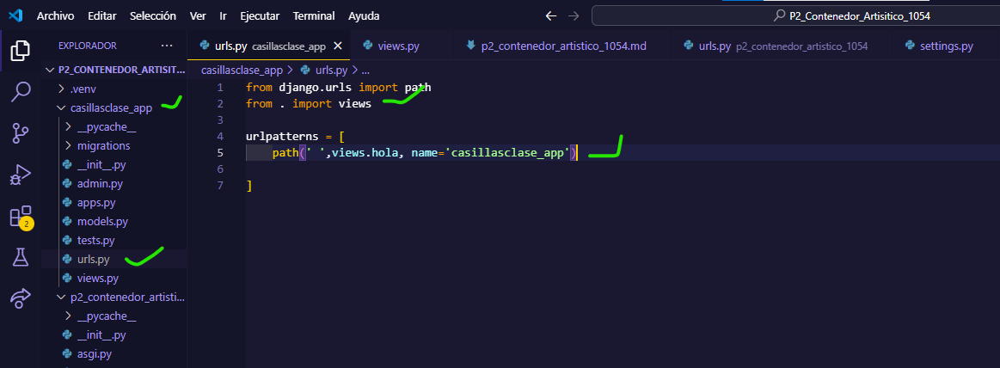

- Crear aplicacion casillasclase_app
- Comando --> python manage.py startapp casillasclase_app
- Creamos el archivo urls.py en casillasclase_app
-
- En setting.py en casillasclase_app
-
-En urls.py de p2_contenedor_artistico_1054
- 
-En urls.py de casillasclase_app
-
-En views.py en casillasclase_app
-
-En urls.py en casillasclase_app
-